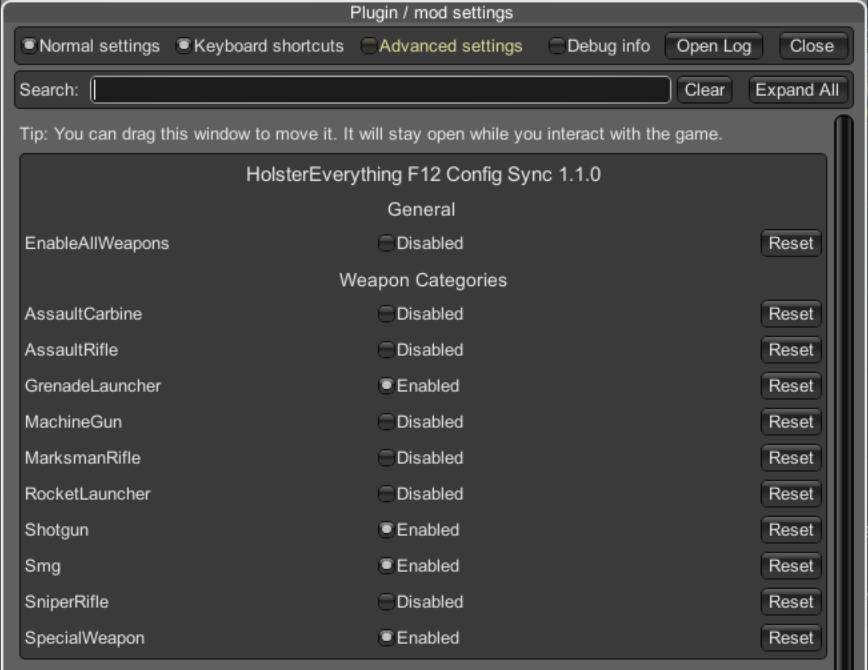

# HolsterEverything (SPT 4.0.13)

HolsterEverything is an SPT mod that lets you control which weapon categories can be equipped in the PMC holster slot, with an optional client-side holster weapon size limit.

## Compatibility
- Built and tested on `SPT 4.0.13`
- Other versions may work, but are not guaranteed

## Download
- Direct download (`v1.2.0`): [Download](https://github.com/alanyung-yl/HolsterEverything/releases/download/v1.2.0/HolsterEverything-v1.2.0.7z)

## What This Mod Changes
- Patches PMC holster whitelist on server startup (`slot id: 55d729d84bdc2de3098b456b`)
- Reads category settings from `config.json`
- Optionally blocks oversized holster weapons
- Supports either:
  - all weapon categories (via base class `5422acb9af1c889c16000029`), or
  - selected direct weapon child categories (except categories excluded from F12 toggles)
- Does not remove or alter vanilla whitelist entries
- Category settings are restart-to-apply
- Holster size settings are adjusted in BepInEx F12 Configuration Manager and apply immediately

## Installation
1. Download the release file
2. Extract it directly into your SPT installation folder
3. Start the game
4. Restart server after changing weapon category settings

## Verify It Loaded
Start the SPT server and check for `HolsterEverything:` log lines.

## Behavior After Removing The Mod
- If you uninstall the mod while a non-default weapon is already in holster, that weapon can remain there in your existing profile
- After you unequip that weapon, you cannot equip it back into holster unless the mod is enabled again

## Uninstall
Delete:

`SPT/user/mods/HolsterEverything`
