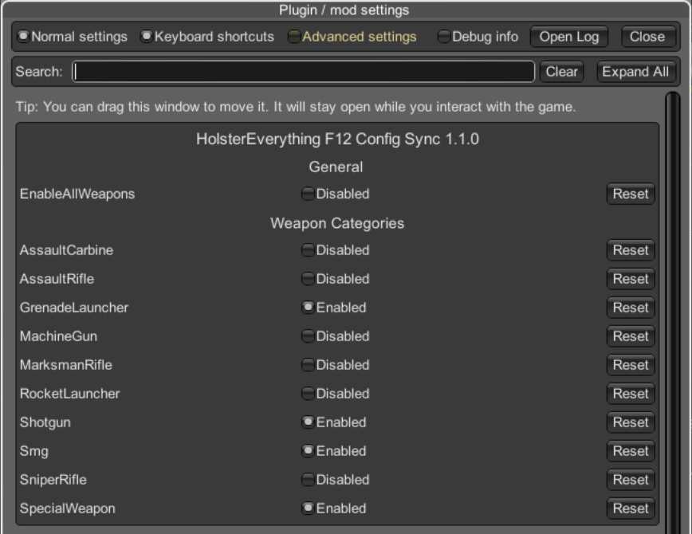

# HolsterEverything (SPT 4.1.3)

HolsterEverything is an SPT mod that lets you control which weapon categories can be equipped in the PMC holster slot, with client-side holster size and holster handling restrictions.

## Compatibility
- Built and tested on `SPT 4.1.3`
- Other versions may work, but are not guaranteed

## Download
- Direct download (`v2.0.0`): [Download](https://github.com/alanyung-yl/HolsterEverything/releases/download/v2.0.0/HolsterEverything-v2.0.0.7z)

### Features
- Lets you choose which weapon categories can be equipped in the holster slot
- Saves your selected weapon category settings for the mod
- Optionally blocks oversized holster weapons
- Optionally treat folded weapons as unfolded for the holster size check
- Optionally keep the size limit off for vanilla holster weapons
- Optionally apply handling penalty to weapon in hand
- Optionally keep the handling penalty off for vanilla holster weapons
- Optionally let non-foldable holstered weapons trigger the handling penalty

### Behavior
- Supports either all weapon categories or only selected weapon categories
- Does not remove or alter vanilla holster whitelist entries
- Weapon category settings require restarting the server
- Holster size and holster handling settings apply immediately
- `Limit Additional Weapons Only` defaults to `true` for both size and handling
- `Use Unfolded Size` checks folded weapons against their unfolded size before allowing a holster drop
- `Enable Handling Penalty` applies an ergonomics penalty to the weapon in hand
- Vanilla holster weapons only trigger the handling penalty when they have an installed stock attachment

## Installation
1. Download the release file
2. Extract it directly into your SPT installation folder
3. Start the game
4. Restart server after changing weapon category settings

## Verify It Loaded
Start the SPT server and check for `HolsterEverything:` log lines.

## Uninstall
Delete:

- `SPT_Runtime/user/mods/HolsterEverything`
- `BepInEx/plugins/HolsterEverything`
- If you uninstall the mod while a non-default weapon is already in holster, that weapon can remain there in your existing profile
- After you unequip that weapon, you cannot equip it back into holster unless the mod is enabled again
